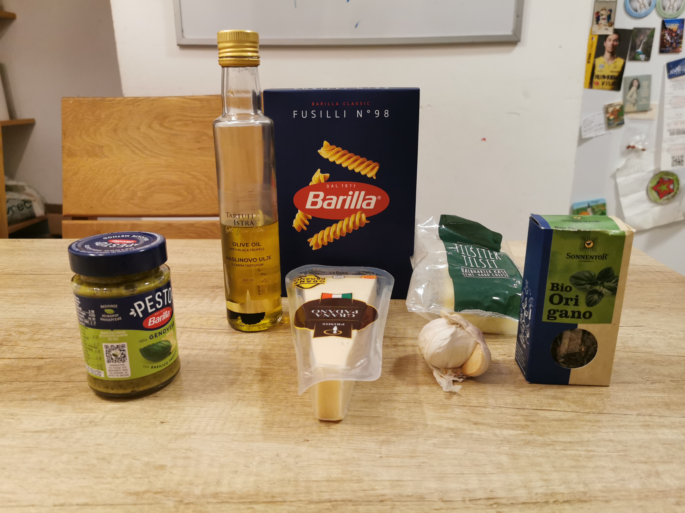
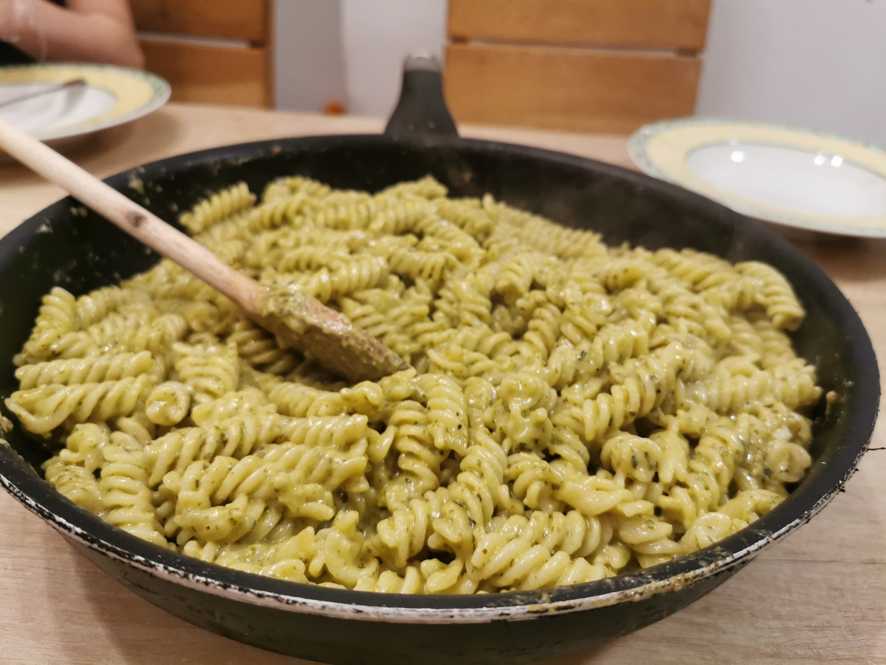
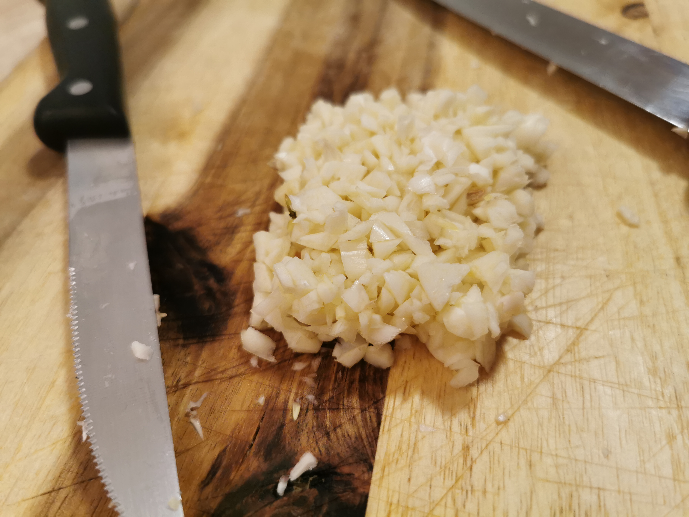
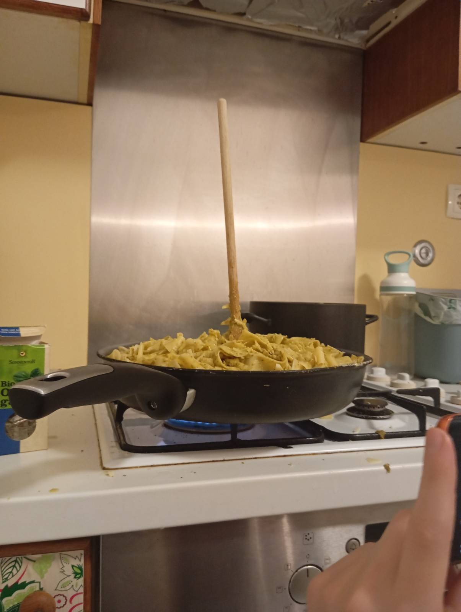
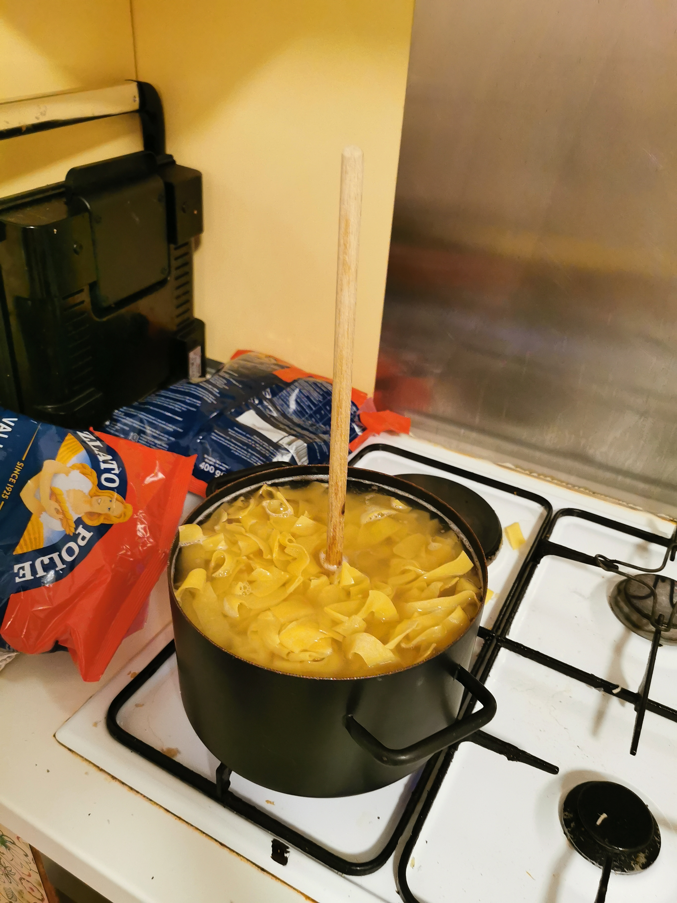

## Ingredients

- Pesto (200g)
- One garlic bulb
- pasta (500g)
- Cheese (1:2 ratio of gauda or something similar and parmesan)
- Salt
- Olive oil (two spoons)
- Oregano (optional)
- Olive oil with truffles (optional)

## Preparation

Cut the garlic into small pieces and grate the cheeses. Cook the pasta as listed on the package. When straining the pasta, make sure to save some (1dl) pasta water in a glass for later use. Sauté the garlic with olive oil and salt. Add the pasta into the pan, let it cook for a few minutes, add the pesto, and afterwards the cheeses. Mix the ingredients until they are evenly distributed, as all capital should be. Put the pasta water into the empty jar of pesto and shake it up. Pour it on the pasta and mix it again. After doing so, you can optionally add some oregano and olive oil with truffles for maximum flavour. Let it cook until some of the pasta water evaporates.

Best eaten while hot, serve it with a ladle or a wooden spoon. You can also use both to ease the process.

_The final product_

_An adequate amount of pasta_

